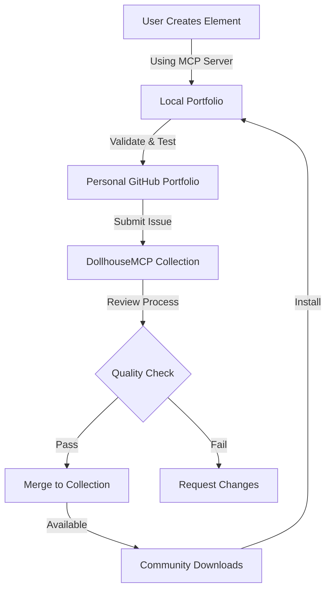

# DollhouseMCP Collection

<div align="center">

📚 **The Official Content Collection for [DollhouseMCP](https://github.com/DollhouseMCP/mcp-server)** 📚

## Status & Quality
[](https://github.com/DollhouseMCP/collection)
[](https://github.com/DollhouseMCP/collection/releases)
[](https://dollhousemcp.github.io/collection/)
[](https://github.com/DollhouseMCP/collection/actions/workflows/build-collection-index.yml)
[](https://github.com/DollhouseMCP/collection/security)
[](docs/VALIDATION.md)

## Compatibility & Technology
[](https://github.com/DollhouseMCP/mcp-server)
[](https://claude.ai/desktop)
[](https://nodejs.org/)
[](https://www.typescriptlang.org/)

## Collection Stats
[](library/)
[](library/)
[](docs/ROADMAP.md)
[](https://github.com/DollhouseMCP/collection/graphs/contributors)

## Documentation & Resources
[](docs/)
[](https://dollhousemcp.github.io/collection/api)
[](docs/QUICK_START.md)
[](docs/examples/)
[](docs/ROADMAP.md)

## Legal & Community
[](https://www.gnu.org/licenses/agpl-3.0)
[](LICENSE-CONTENT)
[](CONTRIBUTING.md)

</div>

## 🌟 What is the DollhouseMCP Collection?

The DollhouseMCP Collection is a comprehensive library of AI-enhancing content including personas, skills, agents, prompts, templates, tools, and ensembles. Built for the Model Context Protocol (MCP), it provides a secure, curated ecosystem for AI augmentation.

### 📦 Content Types

#### ✅ Active Categories
- **🎭 Personas** (6 available) - AI behavioral profiles and character definitions
- **📄 Templates** (10 available) - Document and workflow templates
- **🤖 Agents** (6 available) - Autonomous AI agents for specific tasks
- **🛠️ Skills** (11 available) - Functional capabilities and specialized abilities

#### 🚧 Coming Soon
- **💬 Prompts** (1 in development) - Optimized prompt templates and chains
- **🧠 Memories** (3 in development) - Persistent context and knowledge storage
- **👥 Ensembles** (6 in development) - Curated collections for complex workflows
- **🔧 Tools** (1 in development) - MCP-compatible tools and utilities

## 📈 Live Statistics

<div align="center">

### Collection Growth
<!-- These will be dynamically updated -->
**Total Elements**: 44 | **Last Updated**: 2025-08-28

### Recent Additions
- 🆕 Full-Stack Developer Ensemble
- 🆕 React Expert Agent  
- 🆕 API Documentation Template
- 🆕 Code Review Skill
- 🆕 Creative Writer Persona

[View Full Catalog →](https://dollhousemcp.github.io/collection/)

</div>

## 🚀 Quick Start

### Browse Content

Content is organized in three main areas:

1. **✨ Showcase** - Featured and recommended content
2. **📚 Library** - Free community-contributed content
3. **💎 Catalog** - Premium content (coming soon)

### Using with DollhouseMCP

When using the DollhouseMCP server with Claude or another AI assistant:

```bash
# Browse all content
browse_collection

# Browse specific category
browse_collection "personas"

# Search for content
search_collection "creative writing"

# Get details
get_collection_item "persona" "creative-writer-pro"

# Create and submit new content (coming soon!)
create_persona "My Expert Helper" "A specialized assistant for..."
validate_content "My Expert Helper"
submit_to_collection "My Expert Helper"
```

The MCP server handles all the complexity - just describe what you want to create!

## 🏗️ Repository Structure

```
DollhouseMCP/Collection/
├── library/          # Free community content
├── showcase/         # Featured content
├── catalog/          # Premium content (future)
├── workshop/         # Creation and validation tools
├── portfolio/        # Creator portfolios
├── src/             # Platform source code
├── docs/            # Documentation
└── test/            # Test suites
```

## 🤝 Contributing

We welcome contributions! Please see our [Contributing Guide](CONTRIBUTING.md) for details on:

- Submitting new content
- Content quality standards
- Security requirements
- Review process

### Submission Methods

#### 1. Direct MCP Server Submission (Recommended)
Soon, you'll be able to contribute directly while chatting with Claude or any AI using the DollhouseMCP server:
```
create_content "My Amazing Persona" "persona" "A helpful assistant that..." 
submit_to_collection "My Amazing Persona"
```
The AI will guide you through the process, validate your content, and submit it for review - all within your chat session!

#### 2. Build Your Own Tools
Our validation system is open source! You can create your own tools to:
- Bulk import existing personas, prompts, or tools
- Generate content programmatically
- Integrate with your workflow
- Submit PRs automatically

The validation API ensures all content meets quality and security standards:
```typescript
import { ContentValidator } from '@dollhousemcp/collection';
const validator = new ContentValidator();
const result = await validator.validateContent('my-content.md');
```

#### 3. Traditional GitHub Flow
1. Fork the repository
2. Create your content following our templates
3. Run validation: `npm run validate`
4. Submit a pull request

## 🔒 Security

All content undergoes strict security validation to ensure safety. See our [Security Policy](SECURITY.md) for details.

## 📜 Licensing

This project uses a dual licensing model:

- **Platform Code**: [AGPL-3.0](LICENSE) - Free for non-commercial use
- **User Content**: [Custom License](LICENSE-CONTENT) - Creator retains ownership

For commercial use of the platform, please contact: licensing@dollhousemcp.com

## 🗺️ Architecture

<details>
<summary>Click to view the element submission flow</summary>



</details>

## 🌐 Links

- 🏠 [DollhouseMCP Server](https://github.com/DollhouseMCP/mcp-server) - Core MCP implementation
- 📖 [API Documentation](https://dollhousemcp.github.io/collection/api) - JSON endpoint reference
- 🎯 [Quick Start Guide](docs/QUICK_START.md) - Get started in 5 minutes
- 📝 [Examples](docs/examples/) - Sample implementations
- 🗓️ [Roadmap](docs/ROADMAP.md) - Future features and timeline

## 📅 Changelog

### [v1.0.3] - 2025-08-28
- 📚 Added comprehensive documentation (ROADMAP, VALIDATION, SECURITY, QUICK_START)
- 🎯 Enhanced README with professional badges and organization
- 📝 Created examples directory with implementation guides
- ✨ Improved collection statistics and live data sections

### [v1.0.2] - 2025-08-28
- 🚀 Added GitHub Pages deployment
- 📄 HTML catalog generation
- 🔒 XSS protection and content security
- 📦 JSON API endpoint at /collection-index.json

### [v1.0.1] - 2025-08-27  
- ✨ Initial collection structure
- 🛡️ Security validation system
- 📚 44 founding elements

[Full Changelog →](CHANGELOG.md)

## 🏆 Security & Trust

<div align="center">

### Security Features
- 🛡️ **100% Content Validation** - Every element scanned for security issues
- 🔍 **Pattern Detection** - AI injection & malicious prompt prevention
- ✅ **Automated Testing** - 197+ security tests on every submission
- 📊 **Audit Logging** - Complete security event tracking

[Security Documentation →](docs/SECURITY.md)

</div>

---

<div align="center">

### Contributing

We welcome contributions! Check out our [Contributing Guide](CONTRIBUTING.md) to get started.

For PR submission walkthrough, visit our [Contribution Tutorial](https://dollhousemcp.github.io/collection/contribute)

</div>

---

<div align="center">
Made with ❤️ by the DollhouseMCP Team

[Report Issue](https://github.com/DollhouseMCP/collection/issues) | [Request Feature](https://github.com/DollhouseMCP/collection/issues/new?labels=enhancement) | [Join Discussion](https://github.com/DollhouseMCP/collection/discussions)
</div>