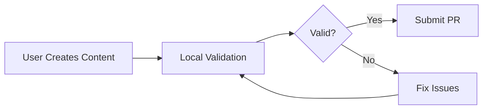
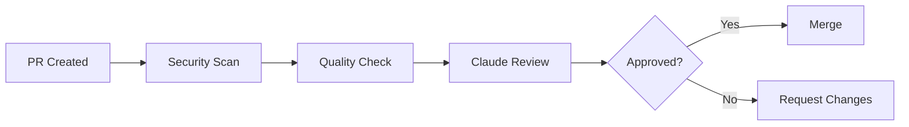
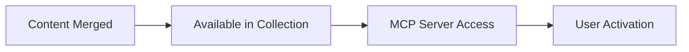

# DollhouseMCP Collection Architecture

## Overview

The DollhouseMCP Collection is built as a secure, scalable content management system for AI-enhancing content. It provides a robust framework for creating, validating, and distributing various types of AI content while maintaining strict security standards.

## System Architecture

```
┌─────────────────────────────────────────────────────────────┐
│                    DollhouseMCP Collection                   │
├─────────────────────────────────────────────────────────────┤
│                                                             │
│  ┌─────────────┐  ┌─────────────┐  ┌─────────────┐       │
│  │  Showcase   │  │   Library   │  │   Catalog   │       │
│  │ (Featured)  │  │   (Free)    │  │  (Premium)  │       │
│  └──────┬──────┘  └──────┬──────┘  └──────┬──────┘       │
│         │                 │                 │               │
│         └─────────────────┴─────────────────┘               │
│                           │                                 │
│                    ┌──────┴──────┐                         │
│                    │  Validation  │                         │
│                    │    Layer     │                         │
│                    └──────┬──────┘                         │
│                           │                                 │
│         ┌─────────────────┴─────────────────┐             │
│         │                                   │             │
│    ┌────┴─────┐                      ┌─────┴────┐        │
│    │ Security │                      │ Quality  │        │
│    │ Scanner  │                      │ Checker  │        │
│    └──────────┘                      └──────────┘        │
│                                                             │
└─────────────────────────────────────────────────────────────┘
```

## Core Components

### 1. Content Storage Layer

**Directory Structure:**
```
collection/
├── showcase/          # Featured content
├── library/           # Free content
├── catalog/           # Premium content (future)
└── src/              # Platform code
    ├── types/        # TypeScript definitions
    ├── validators/   # Content validation
    └── cli/          # Command-line tools
```

**Content Organization:**
- Each content type has its own subdirectory
- Hierarchical categorization (e.g., `personas/creative/`)
- Metadata in YAML frontmatter
- Content in Markdown format

### 2. Validation Layer

**Security Validation:**
- 77+ prompt injection patterns
- 62+ YAML security patterns
- Command execution prevention
- Data exfiltration detection
- Unicode attack prevention

**Quality Validation:**
- Schema compliance (Zod)
- Metadata completeness
- Format consistency
- Size limits
- Line length checks

### 3. Type System

**Base Types:**
```typescript
interface BaseMetadata {
  type: ContentType;
  name: string;
  description: string;
  unique_id: string;
  author: string;
  category: Category;
  version?: string;
  created_date?: string;
  updated_date?: string;
  tags?: string[];
  license?: string;
}
```

**Content-Specific Extensions:**
- PersonaMetadata (triggers, age_rating, etc.)
- ToolMetadata (mcp_config, parameters)
- AgentMetadata (capabilities, tools_required)
- EnsembleMetadata (components references)

### 4. Security Infrastructure

**Multi-Layer Security:**
1. **Content Validation** - Pre-submission checks
2. **CI/CD Security** - Automated scanning on PR/push
3. **CodeQL Analysis** - Code vulnerability detection
4. **Dependency Scanning** - npm audit and Dependabot
5. **Manual Review** - Human verification for featured content

**Security Workflows:**
- `security-scan.yml` - Comprehensive security checks
- `content-security-validation.yml` - Content-specific validation
- `claude-review.yml` - AI-powered security review

### 5. Unique ID System

**Format:** `what-it-is_YYYYMMDD-HHMMSS_who-made-it`

**Examples:**
- `creative-writer_20250715-100000_dollhousemcp`
- `task-prioritizer_20250715-100400_user123`

**Benefits:**
- Globally unique
- Human-readable
- Sortable by type and date
- Includes attribution

## Content Lifecycle

### 1. Creation


### 2. Submission


### 3. Distribution


## Integration Points

### 1. MCP Server Integration
- Direct content browsing via MCP tools
- Installation and activation commands
- Real-time content updates

### 2. GitHub Integration
- PR-based submissions
- Issue tracking
- Version control
- Collaborative review

### 3. CI/CD Integration
- GitHub Actions workflows
- Automated validation
- Security scanning
- Quality assurance

## Security Model

### Threat Model
1. **Prompt Injection** - Malicious instructions in content
2. **Data Exfiltration** - Attempts to steal user data
3. **Code Execution** - Embedded malicious code
4. **Supply Chain** - Compromised dependencies
5. **Social Engineering** - Deceptive content

### Mitigations
1. **Pattern Detection** - Comprehensive security patterns
2. **Sandboxing** - Content isolation
3. **Review Process** - Multi-stage validation
4. **Access Control** - Permission-based operations
5. **Audit Trail** - Complete history tracking

## Performance Considerations

### Optimization Strategies
1. **Lazy Loading** - Content loaded on demand
2. **Caching** - Metadata cached for fast browsing
3. **Indexing** - Search optimization
4. **Compression** - Reduced storage/transfer
5. **CDN** - Future: Global distribution

### Scalability
- Designed for 10,000+ content items
- Hierarchical organization for fast access
- Distributed validation processing
- Horizontal scaling ready

## Future Architecture

### Planned Enhancements
1. **API Layer** - RESTful API for programmatic access
2. **Database Backend** - Move from filesystem to database
3. **Search Engine** - Advanced search capabilities
4. **Analytics** - Usage tracking and insights
5. **Monetization** - Payment processing for premium content

### Cloud Architecture (Future)
```
┌─────────────────────────────────────────┐
│            Load Balancer                │
├─────────────────────────────────────────┤
│     ┌─────────┐      ┌─────────┐      │
│     │ API     │      │  Web    │      │
│     │ Server  │      │  App    │      │
│     └────┬────┘      └────┬────┘      │
│          │                 │           │
│     ┌────┴─────────────────┴────┐     │
│     │      Service Layer        │     │
│     └────────────┬──────────────┘     │
│                  │                     │
│     ┌────────────┴──────────────┐     │
│     │      Data Layer           │     │
│     │  ┌─────┐  ┌─────┐  ┌────┐│     │
│     │  │ SQL │  │NoSQL│  │ S3 ││     │
│     │  └─────┘  └─────┘  └────┘│     │
│     └───────────────────────────┘     │
└─────────────────────────────────────────┘
```

## Development Guidelines

### Code Organization
- TypeScript for type safety
- Modular architecture
- Clear separation of concerns
- Comprehensive testing
- Documentation-first approach

### Best Practices
1. **Security First** - Every feature considers security
2. **User Experience** - Simple, intuitive interfaces
3. **Performance** - Optimize for speed and efficiency
4. **Maintainability** - Clean, documented code
5. **Extensibility** - Easy to add new content types

## Monitoring and Observability

### Metrics
- Content validation success rate
- Security pattern detection rate
- Submission to approval time
- API response times
- Error rates

### Logging
- Structured logging (JSON)
- Security event tracking
- Performance monitoring
- User activity logs
- Error tracking

## Conclusion

The DollhouseMCP Collection architecture prioritizes security, scalability, and user experience. It provides a robust foundation for AI content management while maintaining flexibility for future enhancements.