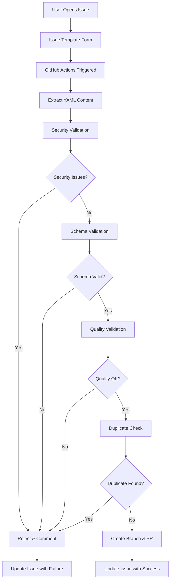

# Element Submission Workflow

## Overview

The DollhouseMCP Collection uses an automated workflow to process element submissions via GitHub issues. This system provides validation, security scanning, and automated PR creation for community contributions.

## Architecture

### Components

1. **GitHub Issue Template** (`.github/ISSUE_TEMPLATE/element-submission.yml`)
   - User-friendly form for submitting elements
   - Collects required metadata and content
   - Includes validation guidelines

2. **GitHub Actions Workflow** (`.github/workflows/process-element-submission.yml`)
   - Triggers on issues with `element-submission` label
   - Performs comprehensive validation
   - Creates PRs for approved submissions
   - Provides feedback on validation results

3. **Validation Script** (`scripts/validate-submission.mjs`)
   - Standalone validator that can be used locally or in CI
   - Integrates with existing validation infrastructure
   - Provides detailed reporting

### Workflow Process



## Validation Stages

### 1. Security Validation

**Critical Patterns** (Auto-reject):
- Code execution attempts (`eval`, `exec`, `system`)
- Prompt injection patterns
- Instruction override attempts
- Restriction removal attempts

**High-Risk Patterns** (Warning):
- File system access
- Process manipulation
- Script injection
- Privilege escalation

**Medium-Risk Patterns** (Warning):
- Base64 data URLs
- Template literal injection
- HTML event handlers
- Debug mode activation

### 2. Schema Validation

**Required Fields:**
- `name`: 3-100 characters
- `description`: 10-500 characters  
- `unique_id`: lowercase, letters/numbers/hyphens/underscores
- `author`: contributor name
- `type`: one of allowed element types

**Optional Fields:**
- `category`: creative, educational, gaming, personal, professional
- `version`: semantic versioning format
- `tags`: array of descriptive tags
- `created_date`, `updated_date`: timestamps

### 3. Quality Validation

**Content Checks:**
- Minimum 50 characters of actual content
- No placeholder text (TODO, FIXME, etc.)
- No Lorem ipsum
- Type-specific requirements

**Metadata Quality:**
- Non-generic descriptions
- Proper unique_id format
- Valid email formats (if provided)

### 4. Duplicate Detection

- Searches existing elements in `library/`, `showcase/`, `catalog/`
- Checks for existing `unique_id` values
- Prevents conflicts and overwrites

## Security Measures

### Input Sanitization

- Content length limits (50KB max)
- Pattern-based malicious content detection
- YAML parsing with security considerations
- File path validation

### Access Control

- Uses `GITHUB_TOKEN` with minimal required permissions
- Branch creation restricted to workflow context
- No external network access during validation
- Secure secret handling

### Error Handling

- Graceful failure with detailed error messages
- Automatic cleanup of temporary files
- Comprehensive logging for debugging
- User-friendly error reporting

## Usage

### For Contributors

1. **Open Issue**: Use the "Element Submission" issue template
2. **Fill Form**: Complete all required fields and paste element content
3. **Submit**: Issue triggers automatic processing
4. **Monitor**: Receive updates on validation and PR status
5. **Respond**: Address any validation failures by editing the issue

### For Maintainers

**Manual Review Triggers:**
- Add `manual-review` label to bypass automation
- Complex elements requiring special handling
- Policy or licensing considerations

**PR Review Process:**
1. Automated PR created after successful validation
2. Manual content review for quality and appropriateness
3. Testing in development environment
4. Approval and merge when ready

### For Developers

**Local Testing:**
```bash
# Run validation script directly
node scripts/validate-submission.mjs "$(cat element.md)"

# Skip duplicate check for testing
node scripts/validate-submission.mjs "$(cat element.md)" --skip-duplicates
```

**Workflow Testing:**
```bash
# Test with act (GitHub Actions locally)
act issues -e test-event.json
```

## Configuration

### Environment Variables

- `NODE_VERSION`: Node.js version (default: 18)
- `VALIDATION_DIR`: Temporary workspace (default: .validation)
- `MAX_ISSUE_SIZE`: Content size limit (default: 50000)
- `SUBMISSION_LABEL`: Trigger label (default: element-submission)

### Permissions Required

```yaml
permissions:
  issues: write        # Comment on issues
  pull-requests: write # Create and manage PRs
  contents: write      # Create branches and commits
```

## Error Handling

### Common Validation Failures

1. **Security Issues**
   - **Cause**: Malicious patterns detected
   - **Solution**: Remove problematic content, review security guidelines
   - **Example**: Code execution attempts, prompt injections

2. **Schema Violations**
   - **Cause**: Missing or invalid required fields
   - **Solution**: Check frontmatter format and required fields
   - **Example**: Missing `type` field, invalid `unique_id` format

3. **Quality Issues**
   - **Cause**: Insufficient or placeholder content
   - **Solution**: Provide complete, meaningful content
   - **Example**: Content too short, contains TODO markers

4. **Duplicates**
   - **Cause**: `unique_id` already exists
   - **Solution**: Choose a different unique identifier
   - **Example**: ID collision with existing element

### Recovery Procedures

**For Failed Validations:**
1. Review error message in issue comment
2. Edit original issue with corrections
3. Workflow automatically re-processes on edit
4. Monitor for successful validation

**For Workflow Failures:**
1. Check workflow logs in Actions tab
2. Contact maintainers if technical issue
3. Use manual review process if needed

## Monitoring and Maintenance

### Metrics to Monitor

- Submission success/failure rates
- Common validation errors
- Processing time per submission
- Security pattern detection rates

### Regular Maintenance

- Update security patterns based on new threats
- Review and improve error messages
- Optimize validation performance
- Update documentation and examples

### Troubleshooting

**Workflow Not Triggering:**
- Check issue has `element-submission` label
- Verify workflow permissions
- Review GitHub Actions quota/limits

**Validation Failures:**
- Check validation logs in workflow output
- Test locally with validation script
- Review security patterns for false positives

**PR Creation Issues:**
- Verify branch naming conflicts
- Check repository permissions
- Review target directory structure

## Future Enhancements

### Planned Improvements

1. **Advanced Validation**
   - AI-powered content quality assessment
   - Automated testing of functional elements
   - Integration testing with MCP servers

2. **Enhanced Security**
   - Dynamic pattern updates
   - Machine learning threat detection
   - Sandboxed execution testing

3. **Better User Experience**
   - Real-time validation feedback
   - Preview rendering of elements
   - Guided submission wizard

4. **Analytics and Reporting**
   - Submission metrics dashboard
   - Quality trend analysis
   - Community contribution insights

## Contributing to the Workflow

### Development Guidelines

1. **Security First**: All changes must maintain security standards
2. **Backward Compatibility**: Preserve existing submission format
3. **Comprehensive Testing**: Test all validation paths
4. **Clear Documentation**: Update docs with any changes

### Testing Procedures

```bash
# Unit tests for validation logic
npm run test:unit

# Integration tests with GitHub API
npm run test:integration

# Security-specific tests
npm run test:security

# Full validation test suite
npm run validate:all
```

### Code Review Requirements

- Security review for pattern changes
- Performance review for validation logic
- UX review for user-facing changes
- Documentation review for completeness